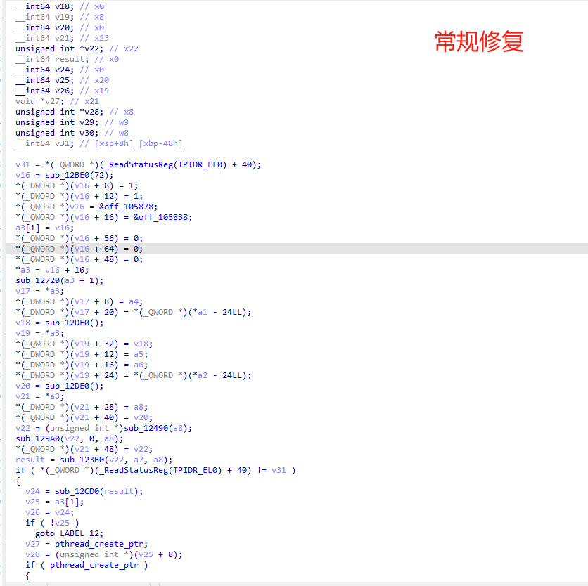
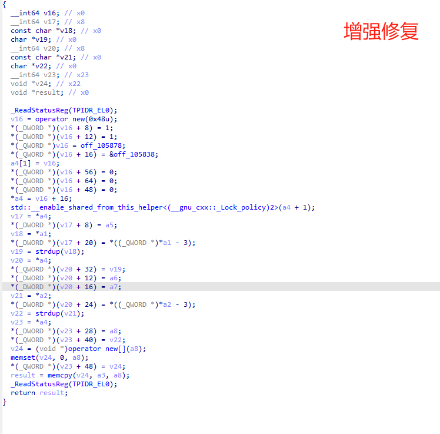

# SoFixer: 内存 SO 文件修复与增强工具

SoFixer 是一款用于修复从 Android 设备内存中 dump 下来的原生共享库（SO 文件）的工具。它旨在解决因直接从内存拷贝导致的 SO 文件结构不完整、符号/重定位信息损坏以及地址偏移等问题，使其能够在 IDA Pro 等反汇编工具中被正确加载和分析。

最新版本的 SoFixer 引入了**增强修复模式**，能够利用外部提供的运行时模块加载信息（`loaded_modules_info.txt`），自动推断目标 SO 文件在内存 dump 时的基地址。基于此基地址，工具可以更精确地修正 SO 内部的各类重定位项，显著提高修复后 SO 文件在分析工具中的准确性和分析效率。

## 主要特性

- **ELF 结构修复**: 修正文件头 (Ehdr)、程序头表 (Phdr) 和节头表 (Shdr)。
- **重定位修复**:
  - 处理常见的 ELF 重定位类型。
  - **增强模式**：结合运行时模块加载信息 (`loaded_modules_info.txt`) 自动推断和应用正确的 dump 时基地址，以修复绝对地址和相对地址引用。
- **跨平台**: 支持在 Windows, Linux, 和 macOS 上编译和运行。
- **支持 32 位与 64 位 SO 文件**: 通过 CMake 参数选择目标架构。
- **静态链接运行时 (可选)**: CMake 配置支持将 C/C++运行时静态链接到`SoFixer`可执行文件中，增强其在不同环境下的便携性。

## 交流与讨论

欢迎加入 Telegram 群组进行程序分析与逆向相关的技术交流：
[程序分析与逆向 @ Telegram](https://t.me/+pXaxOXAZlfM5ZDY1)

## 项目用途与场景

在逆向工程和安全分析中，经常需要从目标进程的内存中 dump 出 SO 文件进行深入研究。然而，直接从内存 dump 的 SO 文件通常存在以下问题：

- **节区不完整或损坏**：内存中的 SO 文件可能与磁盘上的原始文件布局不同，某些节区可能已被部分加载或修改。
- **重定位信息失效**：SO 文件中的重定位条目（如 GOT/PLT 表项）在加载到内存后会被动态链接器解析为绝对地址。这些绝对地址在 dump 出来的文件中是无效的，因为它们依赖于当时进程的内存布局和依赖库的加载基址。
- **符号信息部分丢失**：动态符号表可能仍然存在，但其解析依赖于正确的节区信息和重定位。

SoFixer 致力于解决这些问题，其主要用途包括：

- **使 dump 的 SO 文件可在 IDA Pro 等工具中正确打开和分析**：通过重建 ELF 结构和初步修复重定位，使得反汇编和伪代码生成更为准确。
- **辅助分析加固或内存中动态修改的 SO 文件**：对于一些采取了特殊加载或反调试手段的 SO，内存 dump 是获取其真实执行状态的有效方式，SoFixer 则帮助处理这些 dump 文件。
- **研究 SO 文件的加载和链接机制**：通过修复过程，可以更深入地理解 ELF 格式和动态链接的细节。

## 构建指南

### Windows (使用 Visual Studio)

```shell
# 确保已安装CMake和Visual Studio (推荐 VS2017 或更高版本)
# 打开 Visual Studio 开发者命令提示符 (Developer Command Prompt for VS)
# 或者确保 cmake 和 MSVC 编译器在 PATH 环境变量中

# 创建构建目录
mkdir build
cd build

# 生成 Visual Studio 项目文件 (以64位为例)
# 对于32位, 省略 -DSO_64=ON 或设置为 -DSO_64=OFF
cmake -G "Visual Studio 17 2022" -A x64 -DSO_64=ON ..

# 编译 (Release模式)
cmake --build . --config Release
```

生成的 `SoFixer64.exe` (或 `SoFixer32.exe`) 将位于 `build\Release` 目录下。

### Linux / macOS

```shell
# 确保已安装CMake和C++编译器 (gcc/clang)
mkdir build
cd build

# 生成 Makefile (以64位为例)
# 对于32位, 省略 -DSO_64=ON 或设置为 -DSO_64=OFF
cmake -DSO_64=ON ..

# 编译
make
```

生成的 `SoFixer64` (或 `SoFixer32`) 将位于 `build` 目录下。

## 使用方法

### 1. 从内存中 Dump SO 文件

以下是一个使用 IDA Pro Python 脚本从内存中 dump 指定 SO 模块的示例。你需要根据实际情况修改 SO 的起止地址。

```python
import idaapi
import idc

def dump_so_from_memory(start_addr, end_addr, output_path):
    data_length = end_addr - start_addr
    if data_length <= 0:
        print("Error: Invalid start or end address.")
        return

    try:
        with open(output_path, 'wb') as fp:
            chunk_size = 0x100000  # 1MB per read
            current_offset = 0
            while current_offset < data_length:
                bytes_to_read = min(chunk_size, data_length - current_offset)
                memory_data = idaapi.dbg_read_memory(start_addr + current_offset, bytes_to_read)
                if memory_data is None:
                    print(f"Error reading memory at 0x{start_addr + current_offset:X}")
                    break
                fp.write(memory_data)
                current_offset += bytes_to_read
            print(f"Successfully dumped {current_offset} bytes to {output_path}")
    except IOError as e:
        print(f"Error writing to file: {e}")

# 示例：
# module_name = "libexample.so"
# start_address = idc.get_module_base(module_name)
# end_address = start_address + idc.get_module_size(module_name) # 这可能不总是准确，需要验证
# output_file = "D:\\dumps\\dumped_libexample.so"

# 请替换为实际的起始地址、结束地址和输出路径
# start_address = 0x0000007DB078B000  # 示例起始地址
# end_address = 0x0000007DB08DE000    # 示例结束地址
# output_file = "E:\\path\\to\\dump_example.so"

# if start_address != idaapi.BADADDR and end_address > start_address:
#    dump_so_from_memory(start_address, end_address, output_file)
# else:
#    print(f"Could not determine valid address range for {module_name} or invalid addresses provided.")
```

### 2. （可选）生成模块加载信息文件

为了启用 SoFixer 的增强修复功能（自动推断 dump 基址），你需要一个记录了目标 SO 及其依赖库在 dump 时加载基址的文本文件。
该文件（例如 `loaded_modules_info.txt`）应遵循以下格式，每行代表一个模块：
`ModuleName,LoadAddress(Hex)`

示例 `loaded_modules_info.txt`:

```
# ModuleName,LoadAddress(Hex)
libc.so,0x40270000
libstdc++.so,0x403B5000
libyourtarget.so,0x7DB078B000
libanotherdep.so,0x7DA0100000
```

你可以通过调试器、Frida 脚本或其他内存分析工具在 dump SO 文件时一并获取这些信息。

### 3. 执行修复

```shell
# 基本命令格式 (以64位为例)
SoFixer64.exe -s <dumped_so_path> -o <fixed_so_output_path> [options]

# 选项:
#   -s, --source <path>              必需: 待修复的dumped SO文件路径。
#   -o, --output <path>              必需: 修复后SO文件的保存路径。
#   -l, --modules-info <path>        可选: 包含模块加载信息的文本文件路径 (启用增强修复)。
#                                      如果提供此文件，SoFixer会尝试自动推断主SO的dump基地址。
#   -m, --memso <hex_address>        可选: 手动指定主SO文件在dump时的内存基地址 (十六进制)。
#                                      如果同时提供了 -l 且自动推断成功，此参数可能被覆盖或优先使用。
#                                      如果未提供 -l 或自动推断失败，则必须提供此参数以进行精确修复。
#   -b, --baseso <path>              可选 (实验性): 原始的、未修改的SO文件路径。
#                                      用于尝试恢复dump文件中可能缺失的 .dynamic 段信息。
#   -d, --debug                      可选: 输出详细的调试信息。
#   -h, --help                       可选: 显示帮助信息。

# 示例1: 基本修复 (手动指定dump基址)
SoFixer64.exe -s path/to/dump_example.so -o path/to/fixed_example.so -m 0x7DB078B000

# 示例2: 使用模块信息文件进行增强修复
SoFixer64.exe -s path/to/dump_example.so -o path/to/fixed_example.so -l path/to/loaded_modules_info.txt
```

## 修复效果示例

以下图片展示了 SoFixer 对一个从内存 dump 的 SO 文件（包含损坏的 GOT 表和绝对地址）进行修复前后的效果对比。

**修复前 (原始 Dump)**
在 IDA 中打开原始 dump 的 SO 文件，可以看到 GOT 表项通常显示为无法识别的绝对地址，导致交叉引用和分析困难。



**修复后 (使用 SoFixer 增强修复)**
经过 SoFixer 使用 `-l` 参数进行增强修复后，GOT 表项被修正。对于指向 SO 内部的符号，地址被修正为相对于 SO 新基址的偏移；对于外部符号（如 libc 函数），虽然此处示例中可能未完美解析为外部库函数名（这依赖于更复杂的符号解析和原始依赖库），但其地址已被修正为一个可识别的、非冲突的占位，或基于模块信息的初步解析，使得整体结构更清晰，便于进一步分析。



## 核心原理概述

SoFixer 的工作原理主要基于对 ELF 文件格式的理解和对内存 dump SO 文件常见问题的针对性修复：

1.  **读取和解析**:
    - 读取 dump 的 SO 文件，解析其 ELF 头和程序头表。
    - 如果提供了模块加载信息文件，则解析该文件以获取各模块的运行时基址。
2.  **基地址推断 (增强模式)**:
    - 如果用户未手动指定 dump 基址 (`-m`)，但提供了模块加载信息文件 (`-l`)，SoFixer 会尝试从中查找主 SO 的名称并使用其记录的加载地址作为 dump 基址。
3.  **程序头表 (Phdr) 修复**:
    - 根据 dump 文件的实际内容和推断的加载范围，调整 Phdr 中的 `p_filesz`, `p_memsz`, `p_offset`, 和 `p_paddr`，使其反映 SO 在内存中的实际布局，并为后续在 IDA 中加载时提供正确的段映射。
4.  **节头表 (Shdr) 重建**:
    - SoFixer 会尝试根据 `PT_DYNAMIC` 段中的信息（如 `.dynsym`, `.dynstr`, `.rel.dyn`, `.rel.plt` 等的位置和大小）来重建关键的节头表。这使得 IDA 能够识别这些重要的节区。
5.  **重定位信息 (Relocations) 修复**:
    - **关键步骤**: 这是修复的核心。
    - 遍历 `.rel.dyn` 和 `.rel.plt` (或 `.rela.dyn` / `.rela.plt`) 中的重定位条目。
    - 对于 **相对重定位** (如 `R_ARM_RELATIVE`, `R_AARCH64_RELATIVE`)：将内存中的绝对地址 `A` 减去 dump 时 SO 的基地址 `DUMP_BASE`，得到 `A - DUMP_BASE`，这成为新的相对于修复后 SO 基址（通常视为 0）的偏移。
    - 对于指向 **SO 内部符号的绝对重定位** (通常在 GOT 表中)：将内存中的绝对地址修正为该符号在 SO 内部的偏移 (相对于新基址 0)。
    - 对于指向 **外部库符号的绝对重定位** (如 GOT 表中对 `libc.so` 中 `strdup` 的引用)：
      - 在增强模式下，SoFixer 未来可以利用 `loaded_modules_info.txt` 中的信息，尝试将这些绝对地址转换为 `(外部库名, 库内偏移)` 的形式，或至少将其修正为一个可识别的、不与 SO 内部地址冲突的占位地址。
      - 当前实现主要是将这些外部地址修正为占位符，以避免 IDA 解析错误。
6.  **输出**: 生成一个修复后的 SO 文件，其内部结构更完整，地址引用更符合静态分析工具的预期。

## 已知问题 / 未来工作

- 当前对外部符号的重定位修复主要是设置为占位符或基于初步的模块信息进行调整。未来可以增强为更精确地链接到原始依赖库的符号（如果用户能提供这些库）。
- 对某些极端混淆或 SO 结构损坏严重的情况，修复效果可能有限。
- IDA 脚本示例可以进一步完善，例如自动获取更多模块信息。

## 许可

本项目基于 BSD-3-Clause license。详情请参阅 [LICENSE](LICENSE) 文件。
